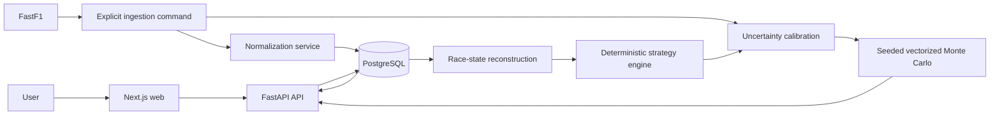

# Apex Strategist

Apex Strategist is a portfolio-grade, historical Formula 1 race engineer simulator.
It caches and normalizes real races through FastF1, then offers a recorded
lap-by-lap replay or a continuous engineer mode where the user owns one driver's
pit calls through a typed FastAPI/Next.js application.

> **Current scope:** Phases 1–6. The deterministic engine remains visible as the
> expected-value anchor, with seeded, vectorized Monte Carlo distributions
> layered on top. Machine-learning lap-time prediction remains deferred.

## Milestone features

- Idempotent single-race and complete-season ingestion with `--force` refresh
- Local FastF1 response cache; no download occurs in read API requests
- PostgreSQL production schema with SQLAlchemy and Alembic
- SQLite-compatible backend tests
- Normalized seasons, events, sessions, drivers, results, laps, tyres, weather,
  race-control messages, and derived pit-lane intervals
- Typed, paginated FastAPI endpoints and OpenAPI docs
- End-of-lap running order, gaps, recent pace, weather, race control, pit
  history, stint timeline, pit-loss estimate, and likely rejoin window
- Validated comparison of pit-now, delayed-pit, and stay-out strategies
- Event/compound tyre-degradation baseline with explicit fallback metadata
- Seeded 100–10,000-run Monte Carlo comparison with empirical calibration,
  bounded fallbacks, compact outcome distributions, and reproducible results
- Probabilistic rule-based recommendation, traffic/degradation risk,
  deterministic comparison, and actual-strategy comparison persisted as a
  versioned calculation artifact
- Next.js race engineer dashboard, strategy lab, results, pace, and lap views
- Playable lap-by-lap replay, animated leaderboard and race orbit, engineer
  radio, decision mode, story chapters, expandable strategy cards, probability
  explorer, and engineer notebook
- Persisted scenario controls for pit-loss and tyre-degradation adjustments
- Zod runtime validation, React Query caching/cancellation, responsive dark UI
- Backend and frontend tests, linting, formatting, Docker, and CI

## Architecture



The browser calls only FastAPI. Provider downloads happen only in the ingestion
service. Route handlers call services and repositories; pandas/FastF1 objects
never leak into API responses. See [architecture documentation](docs/architecture.md).

## Technology

- Web: Next.js App Router, React, TypeScript, Tailwind CSS, React Query, Zod,
  Recharts, Vitest, Testing Library
- API: Python 3.11/3.12, FastAPI, Pydantic, SQLAlchemy, Alembic, pandas, NumPy,
  FastF1, pytest, Ruff
- Runtime: PostgreSQL 16, Docker Compose; SQLite fallback for tests

## macOS setup (exact commands)

Prerequisites: Docker Desktop, Python 3.12, Node.js 20.19+ or 22.13+, and npm.
The Compose database is published on host port `5433` so it can coexist with a
native PostgreSQL installation using the conventional port `5432`.

```bash
cd "/Users/vanshtalreja/Formula 1"
cp .env.example .env
make setup
make db-up
make migrate
make ingest-demo
```

The first demo ingestion downloads every Grand Prix in the 2024 calendar and
can take several minutes. Later runs reuse `./data/fastf1`; already normalized
sessions are skipped. To load another complete season, select one race, or
refresh one race:

```bash
PYTHONPATH=apps/api .venv/bin/python -m app.ingestion.cli ingest-season --year 2023
PYTHONPATH=apps/api .venv/bin/python -m app.ingestion.cli ingest-race --year 2024 --event "Italian Grand Prix"
PYTHONPATH=apps/api .venv/bin/python -m app.ingestion.cli ingest-race --year 2024 --event "British Grand Prix" --force
```

Start the API and web app in two terminals:

```bash
cd "/Users/vanshtalreja/Formula 1"
make api
```

```bash
cd "/Users/vanshtalreja/Formula 1"
make web
```

Open `http://localhost:3001/analyze`. API docs are at
`http://localhost:8000/docs`, and health is at
`http://localhost:8000/api/v1/health`.

## Development commands

```bash
make db-up       # start PostgreSQL
make migrate     # upgrade schema to Alembic head
make migration-check # verify ORM metadata matches Alembic head
make ingest-demo # ingest every GP in DEMO_SEASON (2024 by default)
make train-pace  # prebuild one race-cutoff Engineer Mode pace artifact
make api         # FastAPI with reload
make web         # Next.js development server
make test        # pytest + Vitest
make lint        # Ruff + ESLint
make format      # Ruff formatter + Prettier
make diagnose    # inspect British GP uncertainty inputs/fallbacks
make benchmark   # benchmark 1,000 runs across three strategies
make db-down     # stop PostgreSQL
```

Change `DEMO_SEASON` in `.env` to select a different complete demo season. The
single-race CLI still accepts FastF1's documented event name or round selector.

Historical teams belong to race entries, not to the mutable global driver
record. After upgrading an existing database, populate the new event-specific
column without re-ingesting lap data:

```bash
make migrate
make backfill-entry-teams
```

The backfill loads only FastF1 session results and may be limited to one season
or event with the CLI's `--year` and `--event` options.

## API

- `GET /api/v1/health`
- `GET /api/v1/seasons`
- `GET /api/v1/events?season=2024`
- `GET /api/v1/events/{event_id}`
- `GET /api/v1/events/{event_id}/sessions`
- `GET /api/v1/sessions/{session_id}/drivers`
- `GET /api/v1/sessions/{session_id}/laps?driver_id=1&page=1&page_size=100`
- `GET /api/v1/sessions/{session_id}/race-state?lap=20&driver_id=3`
- `GET /api/v1/sessions/{session_id}/timeline?driver_id=3`
- `GET /api/v1/sessions/{session_id}/actual-strategy/{driver_id}?control_lap=20`
- `POST /api/v1/simulations/compare`
- `GET /api/v1/simulations/{comparison_id}`
- `POST /api/v1/admin/ingest`

The HTTP ingestion endpoint is available for local development only. When
`APP_ENV=production` (or `prod`) it returns `403`; use the ingestion CLI before
deploying the release database.

## Data and modeling notes

FastF1 supplies schedule metadata, session results, laps, tyres, weather, and
race-control messages. Values are checked for missingness and timedeltas become
integer milliseconds. Telemetry is disabled in this milestone to reduce
download size and CPU/memory use; speed-trap fields are lap timing channels, not
high-frequency telemetry. See [data sources](docs/data-sources.md).

The deterministic engine anchors each counterfactual to the recorded race
outcome and remains available beside every result. Phase 5 samples bounded
lap-time, persistent pace, tyre-degradation, pit-loss, tyre-warm-up, traffic,
and nearby-competitor uncertainty around that anchor. It uses NumPy
`Generator` instances and stable child seeds; the same request and seed return
the same aggregates, and candidate ordering does not change a candidate's
samples. See [simulation methodology](docs/simulation.md).

Engineer Mode additionally uses `hgb-pace-v2`, a local scikit-learn
histogram-gradient-boosting model, when enough earlier-race evidence exists.
It predicts nonlinear driver/compound/tyre-age pace relative to the same-lap
field median and adapts from completed laps only. The selected driver's future
laps are excluded. Artifacts are built on first use or can be prebuilt:

```bash
YEAR=2023 EVENT="Canadian Grand Prix" DRIVER_NUMBER=18 CONTROL_LAP=32 make train-pace
```

The deterministic pace estimator remains the fallback for early or sparse
historical cutoffs. Pit, weather, tyre-safety, tyre failure, and classification
rules remain outside the learned pace model. Tyre life itself is calibrated per
event and compound from every driver's stint: pit-ended sets estimate the
competitive window, race-ending sets are treated as censored survival evidence,
and sparse compounds use labelled priors. Health is cumulative and cannot
recover without a pit stop. Pace loss is then applied once in seconds/lap using
`0.015w + 0.00225w² + 0.006max(0,w-50)²`, where `w = 100-health`.
This produces +4.2 s/lap at 60% health. Exactly 5.0% survives; strictly below
5.0% terminates the current lap with `TYRE_FAILURE` and generates no future laps.

Engineer Mode also owns its stint counter and absolute elapsed time. Each user
pit call increments the player stint exactly once; recorded stops never change
it. Once the recorded leader finishes, the player's next line crossing ends
their race. Classification first compares completed laps and only compares
elapsed times among cars on the same lap, so a lapped player cannot be shown
ahead of a full-distance finisher.

Probabilities are frequencies within this model—not bookmaker odds or
guaranteed real-world confidence. Safety Car/VSC and new mechanical failures
are not sampled; their recorded historical effects remain in the deterministic
anchor. Competitors retain their actual trajectories and do not strategically
react to the user's choice.

Inspect or time the model against the ingested 2024 British Grand Prix:

```bash
PYTHONPATH=apps/api .venv/bin/python -m app.simulation.cli diagnose \
  --year 2024 --event "British Grand Prix"
PYTHONPATH=apps/api .venv/bin/python -m app.simulation.cli benchmark \
  --year 2024 --event "British Grand Prix" --simulation-count 1000 --random-seed 42
```

## Testing and verification

Backend tests additionally cover seeded reproducibility, seed variation,
candidate-order independence, bounded distributions, percentile/probability
invariants, labelled fallbacks, persistence, and retired-driver safety.
Frontend tests cover simulation count/seed controls, distribution rendering,
assumptions, and API retry behavior. CI runs test/lint suites and a production
web build.

## Limitations

- Only race sessions from 2018 onward are accepted by this first ingestion CLI.
- Provider gaps can leave nullable values; the UI renders these as unavailable.
- `circuit_name` remains nullable because the verified FastF1 event-schedule
  schema exposes country and location but not a canonical circuit-name column.
- Pit intervals use calculated pit-in/out session timestamps. They are not
  stationary stop times and are kept null when no valid pair exists.
- Driver number is the current limited-scope identity key; broader historical
  coverage will require a stable provider driver ID migration.
- The global driver row is retained as current/fallback metadata. Historical
  APIs use the race entry's name, abbreviation, country, and team snapshots, so
  later transfers or reused car numbers do not rewrite old grids.
- Ingestion is synchronous and intended as an admin/development operation.
- Competitors remain anchored to recorded trajectories and do not strategically
  react to the counterfactual; this is not a full 20-car behavioral simulator.
- No new mechanical DNF, Safety Car, VSC, weather transition, red flag, or
  regulation-level intervention behavior is simulated in Phase 5.
- Races with changing conditions preserve those conditions through the
  recorded-time anchor, but the current strategy builder offers only dry
  compounds; use extra caution interpreting calls that cross wet periods.
- Traffic risk is a bounded rejoin-window heuristic. Warm-up assumptions are
  conservative fallbacks where the public data cannot isolate the effect.
- Tyre health is an event-calibrated gameplay index, not telemetry from the
  tyre carcass. Strategy choices and race-ending stints mean observed stint
  length is censored rather than a direct measurement of physical failure life.

## Roadmap

1. Completed: Phases 1–6 data foundation, race state, deterministic strategy,
   seeded Monte Carlo distributions, and interactive race-engineer experience.
2. Completed correction: leakage-safe, chronologically validated CPU Engineer
   Mode pace model with persisted artifacts and deterministic fallback.
3. Future product work: calibrated incident/weather scenarios, real circuit
   geometry, multi-race evaluation, polish, and deployment.

## Historical-counterfactual disclaimer

This project uses publicly available data and does not reproduce proprietary
team simulators. Predictions are estimates, not proof that a team made a wrong
decision. Weather, driver behaviour, team orders, mechanical
conditions, and competitors' responses can only be approximated.

## Resume-ready description

Built a typed Next.js/FastAPI motorsport data platform that ingests and caches
historical Formula 1 sessions, reconstructs end-of-lap race state, and serves an
accessible strategy lab with a preserved deterministic baseline plus seeded,
vectorized Monte Carlo distributions, persisted counterfactuals, explicit
fallback metadata, contract validation, diagnostics, and tests.
