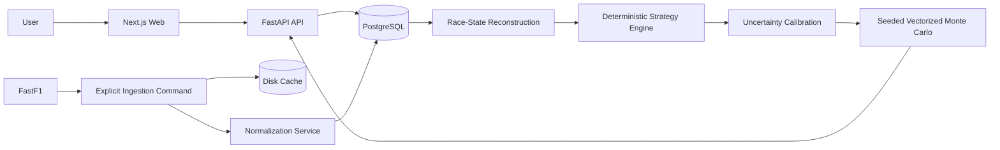

# Apex Strategist

> A historical Formula 1 race-engineer simulator for replaying real races, testing alternative pit strategies, and comparing deterministic and Monte Carlo outcomes.

[](https://apex-strategist-web.vercel.app/)
[](https://nextjs.org/)
[](https://fastapi.tiangolo.com/)
[](https://www.postgresql.org/)
[](https://www.python.org/)

**Live app:** https://apex-strategist-web.vercel.app/

Apex Strategist caches and normalizes historical Formula 1 races through FastF1, then lets users replay races lap by lap or enter a continuous **Engineer Mode** where they control one driver's pit calls through a typed FastAPI + Next.js application.

The deterministic strategy engine remains visible as the expected-value anchor, while seeded, vectorized Monte Carlo simulations model uncertainty around alternative decisions. Engineer Mode also supports a local learned pace model when sufficient historical evidence is available.

## Highlights

- Historical Formula 1 race ingestion through FastF1
- Playable lap-by-lap race replay with animated leaderboard and race orbit
- Continuous Engineer Mode with user-controlled pit calls
- Pit-now, delayed-pit, and stay-out strategy comparisons
- Seeded 100–10,000-run Monte Carlo simulations
- Deterministic strategy baseline shown alongside probabilistic outcomes
- Event- and compound-specific tyre degradation modeling
- Traffic, warm-up, pit-loss, degradation, and nearby-car uncertainty
- Strategy recommendations with probability distributions and risk indicators
- Actual-strategy comparison against the recorded race
- Local `hgb-pace-v2` learned pace model for eligible Engineer Mode cutoffs
- Persisted scenario controls for pit-loss and tyre-degradation adjustments
- Typed FastAPI endpoints, OpenAPI docs, Zod runtime validation, and React Query caching
- PostgreSQL + Alembic production schema with SQLite-compatible backend tests
- Docker, CI, linting, formatting, frontend tests, and backend tests

## Architecture



The browser communicates only with FastAPI. Provider downloads occur exclusively through the ingestion service. Route handlers call services and repositories, and pandas/FastF1 objects never leak into API responses.

See [`docs/architecture.md`](docs/architecture.md) for more detail.

## Tech Stack

### Frontend

- Next.js App Router
- React
- TypeScript
- Tailwind CSS
- React Query
- Zod
- Recharts
- Vitest
- Testing Library

### Backend

- Python 3.11 / 3.12
- FastAPI
- Pydantic
- SQLAlchemy
- Alembic
- pandas
- NumPy
- FastF1
- scikit-learn
- pytest
- Ruff

### Runtime

- PostgreSQL 16
- Docker Compose
- SQLite fallback for tests

## Project Scope

The current implementation covers Phases 1–6 of the project roadmap.

The deterministic engine acts as the expected-value anchor, with seeded Monte Carlo distributions layered on top. Engineer Mode can additionally use a local histogram-gradient-boosting pace model when enough earlier-race evidence is available; broader machine-learning lap-time prediction remains outside the current scope.

## Local Setup

### Prerequisites

Install:

- Docker Desktop
- Python 3.12
- Node.js 20.19+, 22.13+, or 24+
- npm

The Compose database is exposed on host port `5433`, allowing it to coexist with a native PostgreSQL instance using the default `5432` port.

### 1. Configure the environment

From the repository root:

```bash
cp .env.example .env
```

### 2. Set up the project

```bash
make setup
make db-up
make migrate
make ingest-demo
```

The first demo ingestion downloads every Grand Prix in the configured demo season and can take several minutes. Later runs reuse `./data/fastf1`, and already-normalized sessions are skipped.

### 3. Start the API

```bash
make api
```

### 4. Start the web app

In another terminal:

```bash
make web
```

Then open:

- Web app: `http://localhost:3001/analyze`
- API docs: `http://localhost:8000/docs`
- Health check: `http://localhost:8000/api/v1/health`

## Data Ingestion

Load another complete season:

```bash
PYTHONPATH=apps/api .venv/bin/python -m app.ingestion.cli ingest-season --year 2023
```

Load a single race:

```bash
PYTHONPATH=apps/api .venv/bin/python -m app.ingestion.cli ingest-race \
  --year 2024 \
  --event "Italian Grand Prix"
```

Force-refresh an existing race:

```bash
PYTHONPATH=apps/api .venv/bin/python -m app.ingestion.cli ingest-race \
  --year 2024 \
  --event "British Grand Prix" \
  --force
```

## Development Commands

```bash
make db-up            # Start PostgreSQL
make migrate          # Upgrade schema to Alembic head
make migration-check  # Verify ORM metadata matches Alembic head
make ingest-demo      # Ingest every GP in DEMO_SEASON
make train-pace       # Prebuild one race-cutoff Engineer Mode pace artifact
make api              # Start FastAPI with reload
make web              # Start Next.js development server
make test             # Run pytest + Vitest
make lint             # Run Ruff + ESLint
make format           # Run Ruff formatter + Prettier
make diagnose         # Inspect British GP uncertainty inputs/fallbacks
make benchmark        # Benchmark 1,000 runs across three strategies
make db-down          # Stop PostgreSQL
```

Change `DEMO_SEASON` in `.env` to select a different complete demo season. The single-race CLI accepts FastF1's documented event name or round selector.

## Historical Team Backfill

Historical teams belong to race entries rather than the mutable global driver record.

After upgrading an existing database, populate the event-specific team column without re-ingesting lap data:

```bash
make migrate
make backfill-entry-teams
```

The backfill loads only FastF1 session results and can be limited with the CLI's `--year` and `--event` options.

## API Endpoints

```text
GET  /api/v1/health
GET  /api/v1/seasons
GET  /api/v1/events?season=2024
GET  /api/v1/events/{event_id}
GET  /api/v1/events/{event_id}/sessions
GET  /api/v1/sessions/{session_id}/drivers
GET  /api/v1/sessions/{session_id}/laps?driver_id=1&page=1&page_size=100
GET  /api/v1/sessions/{session_id}/race-state?lap=20&driver_id=3
GET  /api/v1/sessions/{session_id}/timeline?driver_id=3
GET  /api/v1/sessions/{session_id}/actual-strategy/{driver_id}?control_lap=20
POST /api/v1/simulations/compare
GET  /api/v1/simulations/{comparison_id}
POST /api/v1/admin/ingest
```

The HTTP ingestion endpoint is intended for local development only. When `APP_ENV=production` or `APP_ENV=prod`, it returns `403`. Production data should be ingested through the CLI before deployment.

## Data and Modeling

FastF1 supplies:

- Schedule metadata
- Session results
- Laps
- Tyres
- Weather
- Race-control messages

Values are checked for missingness, and timedeltas are converted to integer milliseconds.

High-frequency telemetry is disabled in the current milestone to reduce download size and CPU/memory usage. Speed-trap fields are lap-timing channels rather than full telemetry streams.

See [`docs/data-sources.md`](docs/data-sources.md).

## Strategy Simulation

The deterministic engine anchors each counterfactual to the recorded race outcome and remains available beside every result.

Monte Carlo simulation samples bounded uncertainty around that anchor, including:

- Lap-time variation
- Persistent pace variation
- Tyre degradation
- Pit loss
- Tyre warm-up
- Traffic
- Nearby-competitor effects

Simulations use NumPy `Generator` instances and stable child seeds. The same request and seed produce the same aggregates, and candidate ordering does not alter a candidate's samples.

See [`docs/simulation.md`](docs/simulation.md).

## Engineer Mode Pace Model

Engineer Mode can use `hgb-pace-v2`, a local scikit-learn histogram-gradient-boosting model, when enough earlier-race evidence exists.

It predicts nonlinear driver / compound / tyre-age pace relative to the same-lap field median and adapts only from completed laps. The selected driver's future laps are excluded from training evidence.

Artifacts are built on first use or can be prebuilt manually:

```bash
YEAR=2023 \
EVENT="Canadian Grand Prix" \
DRIVER_NUMBER=18 \
CONTROL_LAP=32 \
make train-pace
```

The deterministic pace estimator remains the fallback for early or sparse historical cutoffs.

Pit rules, weather rules, tyre-safety rules, tyre failure, and classification logic remain outside the learned pace model.

## Tyre Model

Tyre life is calibrated per event and compound using every driver's stint.

- Pit-ended sets estimate the competitive window
- Race-ending sets are treated as censored survival evidence
- Sparse compounds fall back to labelled priors
- Tyre health is cumulative and cannot recover without a pit stop

Pace loss is applied once in seconds per lap using:

```text
0.015w + 0.00225w² + 0.006max(0, w - 50)²
```

where:

```text
w = 100 - health
```

This produces approximately `+4.2 s/lap` at `60%` tyre health.

Exactly `5.0%` health survives. Strictly below `5.0%` terminates the current lap with `TYRE_FAILURE` and generates no future laps.

## Race-State and Classification Rules

Engineer Mode owns its own stint counter and absolute elapsed time.

- Each user pit call increments the player stint exactly once
- Recorded stops never alter the player stint counter
- Once the recorded leader finishes, the player's next line crossing ends their race
- Classification compares completed laps first
- Elapsed time is compared only among cars on the same lap

This prevents a lapped player from being classified ahead of a full-distance finisher.

## Model Limitations

Probabilities are frequencies within this model, not bookmaker odds or guaranteed real-world confidence.

The current simulation does **not** sample new:

- Safety Cars
- Virtual Safety Cars
- Mechanical failures

Their recorded historical effects remain part of the deterministic anchor.

Competitors also retain their actual historical trajectories and do not strategically react to the user's choices.

## Diagnostics and Benchmarking

Inspect the model against the ingested 2024 British Grand Prix:

```bash
PYTHONPATH=apps/api .venv/bin/python -m app.simulation.cli diagnose \
  --year 2024 \
  --event "British Grand Prix"
```

Benchmark 1,000 simulation runs across three strategies:

```bash
PYTHONPATH=apps/api .venv/bin/python -m app.simulation.cli benchmark \
  --year 2024 \
  --event "British Grand Prix" \
  --simulation-count 1000 \
  --random-seed 42
```

## Testing and Verification

Backend tests cover:

- Seeded reproducibility
- Seed variation
- Candidate-order independence
- Bounded distributions
- Percentile and probability invariants
- Labelled fallbacks
- Persistence
- Retired-driver safety

Frontend tests cover:

- Simulation-count controls
- Random-seed controls
- Distribution rendering
- Assumptions
- API retry behavior

CI runs test and lint suites plus a production web build.

## Historical Counterfactual Disclaimer

This project uses publicly available data and does not reproduce proprietary Formula 1 team simulators.

Predictions are estimates, not proof that a team made an incorrect decision. Weather, driver behavior, team orders, mechanical conditions, and competitors' responses can only be approximated.

---

**Try Apex Strategist:** https://apex-strategist-web.vercel.app/
