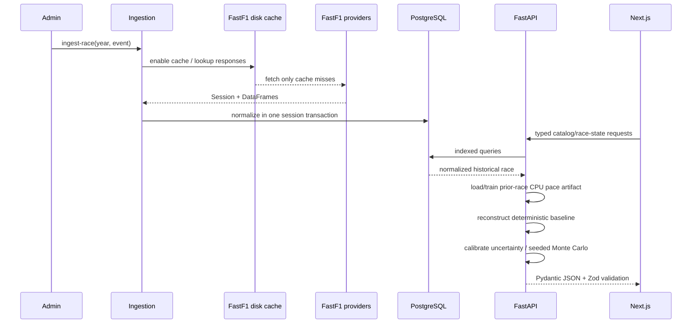
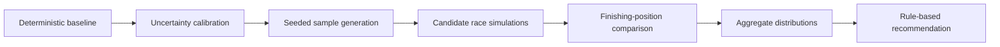
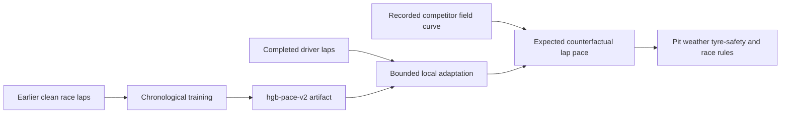

# Architecture

## Boundaries

The Next.js App Router frontend owns presentation and selection state. A shared
API module handles fetch cancellation and Zod response validation; React Query
owns remote cache state. No provider request or race calculation runs in the
browser.

FastAPI route handlers validate HTTP inputs and delegate to services. Catalog
services shape response schemas; repositories own SQLAlchemy queries. The
ingestion service is the only module that sees pandas/FastF1 provider objects.
Shared serialization helpers normalize missing values, NumPy scalars,
timestamps, and timedeltas.

## Data flow

## Persistence

Season/event/session records form the catalog. Race entries relate persistent
driver records to one session and own the team represented in that race. The
global driver's team is only a nullable compatibility fallback; it is not the
source of truth for historical grids. Lap uniqueness is enforced on session, driver,
and lap number. Weather timestamps and pit-stop lap tuples are unique within a
session. Session-owned records cascade on deletion. Alembic is the authoritative
production schema path.

Re-ingestion records `loading` before normalization. On success the session is
`complete`; on normalization failure the transaction rolls back and a bounded
error is recorded as `failed`. `--force` clears only records owned by the target
session.

## Race state and deterministic strategy

`RaceStateService` reconstructs each driver's latest completed lap at the
control point, sorts end-lap positions, returns time gaps only for cars on a
comparable lap, and joins nearest weather, recent race-control messages, pit
history, and a robust event pit-loss estimate.

The deterministic engine uses a fresh selected-driver/model pace baseline,
event/compound field-stint life calibration, cumulative tyre health, one
nonlinear seconds-per-lap health curve, pace mode, warm-up, pit loss, and a
historical rejoin window. Counterfactual totals are anchored to the selected
driver's recorded result so historical weather and neutralizations are not
silently replaced by a constant dry-pace projection. Competitors retain their
recorded trajectories. Legacy comparisons retain their stored provenance; new
results use `deterministic-v2` and `monte-carlo-v2`.

## Monte Carlo layer

`StrategyService` loads and normalizes all laps, entries, pit intervals, and
same-circuit history before simulation. `UncertaintyCalibrator` estimates robust
lap residual and persistent driver-pace scales, tyre slope uncertainty, and the
accepted pit-loss sample. Each source carries its sample count, fallback flag,
scale, and assumption.

`MonteCarloStrategyEngine` retains each deterministic outcome as its central
anchor. NumPy arrays have the conceptual shape `simulation_count ×
remaining_laps`; lap residuals use a bounded AR(1) process and a small
race-remainder pace draw rather than unrelated extreme noise. Pit loss is
bootstrapped where possible. Degradation, warm-up, traffic, and modest
competitor variation are bounded. Aggregation produces compact finish counts,
time-delta histogram bins, percentiles, and headline probabilities. Individual
trajectories are deliberately not persisted.

Common driver and competitor draws use a request-level `SeedSequence`.
Strategy-specific draws use a stable hash of the strategy's semantic fields,
not list position or display name. This preserves reproducibility and prevents
candidate insertion or reordering from perturbing existing candidates. Shared
draws also improve fairness in paired stay-out comparisons.

The existing JSON request/result columns persist the engine version, validated
count/seed, deterministic projections, aggregates, distributions, source
metadata, and assumptions. This required no schema migration. Backward-
compatible response defaults keep saved `deterministic-v1` records readable.

## Deferred components

Safety Car/VSC has an explicit disabled calibration source, and no new
mechanical failures are sampled. Competitors remain historical anchors with
modest timing uncertainty; they do not strategically react to the user's
counterfactual.

## Engineer pace model

`pace_model.py` owns the scikit-learn feature construction, chronological
cutoff query, training/validation split, artifact loading, completed-lap driver
adaptation, and same-lap field reference. `StrategyService` requests a
session-specific predictor and passes it into the deterministic engine; routes
remain thin. Artifacts are local joblib files registered through the existing
`model_artifacts` table. If the cutoff has fewer than 2,000 clean rows or model
loading fails, the service logs the failure and preserves the deterministic
fallback.

## Phase 6 interaction layer

The interaction layer has two dedicated routes backed by the shared
`RaceWorkspace` data controller. `/analyze` owns read-only historical playback
through `RaceReplay`; `/engineer` starts at lap 1 and gives `EngineerMode` a
continuous one-lap-at-a-time decision loop. Both use the same race catalog,
race-state and timeline APIs and show recorded weather for every lap. Keeping
the URLs separate makes each experience unambiguous without duplicating query
or simulation logic.

The carried player state includes absolute elapsed time, completed laps, and
the player-owned stint number in addition to compound, tyre age, cumulative
effective age, tyre health, position, and
historical delta. A player pit increments that stint; a historical pit does not.
At the leader's recorded finish time, the player's first subsequent line
crossing produces a terminal `CHEQUERED` projected lap and returns the UI to the
final field frame.

The visible engineer action is only Box plus compound, or Stay out by making no
selection. When this differs from the recorded call, the client submits a
responsive 500-run comparison internally, applies only the next projected lap,
and returns control to the user. The optional `simulation_context` carries the
active compound, tyre age/health, position, and cumulative timing delta into every
later request, preventing the deterministic and Monte Carlo engines from
snapping back to history.

`InteractiveStrategyDeck` renders the returned aggregates as animated outcome
formation, expandable strategy cards, a normalized radar comparison, selectable
finish buckets, and structured notebook notes. The original detailed table and
charts remain available for auditability.
