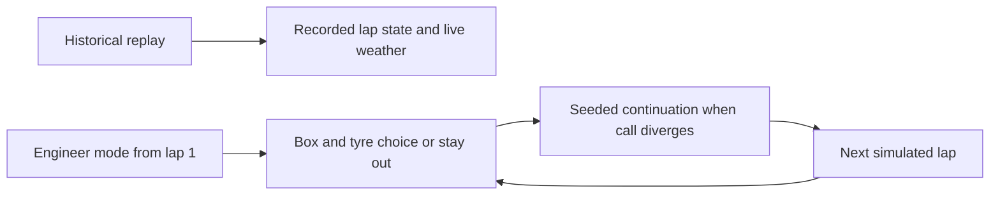

# Phase 6 Interactive Race Engineer Experience

## Product flow

Phase 6 keeps the Phase 5 deterministic and Monte Carlo engines intact while
offering two explicit workflows:

The replay begins on lap 1 and spans every official race lap. Moving it requests the normalized
end-of-lap race state, while React Query retains the previous frame until the
next one arrives. Framer Motion interpolates leaderboard order, gap bars, tyre
health, driver markers, panels, and result expansion. Reduced-motion system
preferences disable nonessential animation.

## Replay workstation

- Play, pause, restart, or scrub any completed lap.
- Position, compound, tyre age, weather, race-control state, gaps, and rejoin
  context update from the existing historical APIs.
- Pit markers use the selected driver's normalized pit-stop timeline.
- The animated leaderboard supports driver selection and up to three pinned
  synchronized comparisons.
- Engineer radio messages are structured from weather, tyre, pit-window,
  rejoin, and race-control data; they are not LLM-generated.
- Story mode divides the race around recorded pit events and links each chapter
  back to its replay control point.

At the final lap the API returns the recorded classification and the replay
switches to a chequered-flag state. Podium finishes receive a restrained podium
animation; no strategy decision is offered after the race has finished.

The track panel is deliberately labelled a **schematic race orbit**. FastF1 lap
normalization in this project does not store car GPS traces, circuit geometry,
DRS-zone geometry, or sector-level weather. The application therefore animates
relative race progress and driver selection without presenting invented
coordinates as telemetry. Recorded time gaps are converted into fractions of
the leader's recent lap time, so cars spread around the orbit instead of being
stacked at one coordinate. The selected driver enters the schematic pit lane on
a recorded pit lap.

## Continuous engineer mode

Engineer mode always starts on lap 1. At each lap the user either selects Box
and one of five compounds, or leaves the tyres unselected and advances to stay
out. The old pit-now/delay/stay-out card comparison is not part of this flow.

Engineer mode creates an independent player trajectory on the first advance,
even when the user chooses Stay out. Recorded driver pit decisions and pit-lane
flags are never applied to the player car. Only the next simulated lap is
applied, so the user remains in control and can make another decision. Later
simulations receive the carried compound, tyre age, position, player-owned
stint, completed-lap count, absolute elapsed time, and cumulative time delta
through `simulation_context`; they never reset to the recorded driver's
strategy. A user pit advances the player stint once, while a recorded pit has
no effect on that counter.

The backend may calculate a compact reference candidate internally to measure
uncertainty, but this is an implementation detail rather than a comparison UI.
Interactive calls use 500 simulations for responsive local CPU performance.

The first scenario controls are genuine engine inputs:

- pit-lane loss adjustment: −10 to +10 seconds;
- tyre-degradation multiplier: −50% to +50%.

They are stored in the validated simulation request, affect deterministic and
Monte Carlo calculations, and are labelled as user-defined counterfactuals—not
predictions. Pit-lane-closure, competitor-reaction, and weather-timing controls
remain unavailable until the underlying simulation can represent them honestly.

Soft, Medium, Hard, Intermediate, and Wet are available. When a compound has
enough clean event laps it uses the empirical event fit. Otherwise it uses the
labelled conservative compound fallback and exposes that lower data quality in
the returned tyre estimate.

Every candidate now includes a compact deterministic remainder trajectory. For
each future lap it returns compound, tyre age, projected lap time, cumulative
time, pit event, and position against recorded competitor trajectories. The
trajectory is anchored lap by lap to recorded historical timing, retaining the
effects of observed weather and neutralizations while applying the user's tyre,
pace, degradation, and pit-loss consequences. Expand a strategy and select
**Replay consequence** to animate it through the rest of the race.

Expected lap pace in Engineer Mode uses the leakage-safe `hgb-pace-v2` CPU
model when at least 2,000 eligible laps predate the selected race. It learns
nonlinear driver/compound/tyre-age pace relative to the same-lap field median,
then adapts its driver offset from completed laps only. It does not read the
selected driver's future timing. If the cutoff is too early or the artifact is
unavailable, the existing deterministic pace estimator remains the explicit
fallback.

## Live decision information

- Both modes show the recorded lap's rain state, track and air temperature,
  humidity, and wind speed as a prominent live-weather panel.
- The main engineer panel shows the evolving simulated position, compound,
  tyre age, time delta, last simulated finish range, and decision notebook.
- The tyre-degradation gauge is a modeled pace-reserve index derived from every
  driver's stints on that compound in the selected event. It shows the fitted
  performance window, terminal reserve, field-stint sample count, and fallback
  source. A new set starts at 100% on its pit-out lap; it is not presented as
  measured physical carcass wear.
- Reaching the conservative 5% reserve floor triggers a puncture and terminal
  DNF. The driver is removed from further decisions and receives zero simulated
  win, podium, and points probability.
- A full-field race orbit and live order show every classified driver, gap to
  the leader in seconds, active compound, and pit-lane state. The user's row
  reflects the active counterfactual position, tyre, and accumulated time delta.
- Active Safety Car and VSC periods are called out with their start lap and the
  drivers recorded as boxing during the intervention.
- Every decision advances exactly one lap; there is no separate rest-of-race
  result that takes control away from the user.
- Engineer telemetry uses recorded laps only for initialization, then replaces
  every applied lap with the player's simulated pace, tyre, position, and time.
- Once the historical leader has finished, the player's next line crossing is
  chequered. The final order ranks completed laps before elapsed time, so lapped
  cars cannot displace full-distance finishers.

## Accessibility and limitations

Replay and result controls use native buttons, range inputs, labels, live
regions, text summaries, and keyboard-operable disclosure elements. Charts keep
accessible summaries. Motion respects `prefers-reduced-motion`.

This phase does not fabricate telemetry or reactive opponents. Competitors
remain anchored to historical trajectories. The schematic map does not claim
actual on-track coordinates, and explicit scenario sliders cover only model
variables the current engine can apply consistently.
